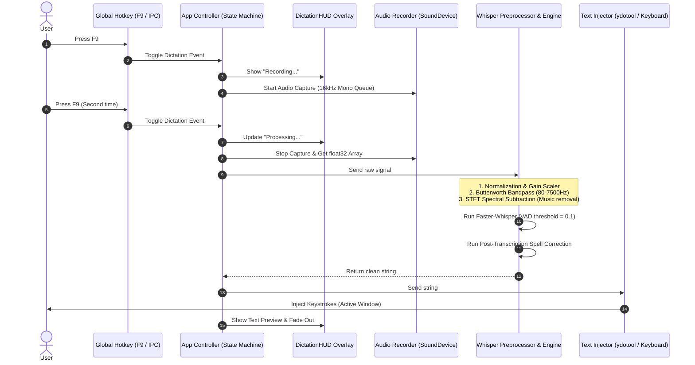

# WoiceFlow 🎙️

**System-wide offline voice dictation for Linux, macOS, and Windows.**

WoiceFlow captures microphone audio via a global hotkey (**F9**), processes the signals locally to filter out noise and amplify quiet whispers, transcribes it using [Faster-Whisper](https://github.com/SYSTRAN/faster-whisper), and injects the result directly into whatever window is currently active — 100% offline, private, and subscription-free.

---

## 📖 Table of Contents

1. [✨ Key Features](#-key-features)
2. [⚙️ How It Works & Lifecycle](#️-how-it-works--lifecycle)
3. [🏛️ Architectural Module Deep-Dive](#️-architectural-module-deep-dive)
4. [🎙️ Whisper & Audio Preprocessing Engine](#️-whisper--audio-preprocessing-engine)
5. [🗂️ Project Structure](#️-project-structure)
6. [🚀 Installation Guide](#-installation-guide)
   - [🐧 Linux (Ubuntu, Debian, Fedora, Arch)](#-linux)
   - [🍏 macOS (Intel & Apple Silicon)](#-macos)
   - [🪟 Windows (Automated & Standalone EXE)](#-windows)
7. [🛠️ Developer Setup](#️-developer-setup)
8. [⚙️ Configuration & Environment Variables](#️-configuration--environment-variables)
9. [🌐 Marketing Website (Next.js + Bun + Tailwind CSS)](#-marketing-website-nextjs--bun--tailwind-css)
10. [📈 Advanced Tuning & Performance Optimization](#-advanced-tuning-and-performance-optimization)
11. [❌ Troubleshooting & FAQs](#-troubleshooting--faqs)
12. [🤝 Contributing & License](#-contributing--license)

---

## ✨ Key Features

* **Global Hotkey Integration (F9)**: Press once to begin recording, speak, and press again to stop. Works across all active windows and terminal prompts.
* **100% Local and Offline**: Powered by `Faster-Whisper` (leveraging CTranslate2). Keeps your vocal data private without sending any metrics or audio samples to remote servers.
* **Intelligent Whisper & VAD Preprocessing**:
  - **Auto Gain Scaling**: Normalizes low-frequency/whispered audio to ensure quiet dictation is transcribed perfectly.
  - **Butterworth Bandpass Filter**: Employs a custom frequency band (`80Hz - 7500Hz`) to preserve high-frequency vocal sibilants essential for transcribing whispering.
  - **Spectral Subtraction**: Uses Short-Time Fourier Transform (STFT) noise gating to subtract steady background noise, fans, and music.
  - **Ultra-low VAD Thresholding**: Lowers Voice Activity Detection activation limits (`threshold=0.1`) so quiet inputs aren't dropped.
* **System-wide Text Injection**: Emulates keyboard signals directly at your current cursor position, supporting GNOME, KDE, Wayland, X11, macOS Accessibility, and Windows user-space inputs.
* **DictationHUD™ overlay**: A beautiful glassmorphic PyQt6 window that floats above all apps, showing the real-time recording state (`idle` → `recording` → `transcribing` → `done`).
* **Technical Typo Correction**: Post-processes transcribing to resolve common spelling and capitalization mistakes for tech terms (e.g., correcting *next js* to `Next.js`, *github* to `GitHub`, *typescript* to `TypeScript`).
* **IPC Socket Control**: Built-in socket listener lets external scripts trigger recording, ideal for custom keybindings or automation pipelines.

---

## ⚙️ How It Works & Lifecycle

Below is the execution pipeline showing how hotkeys, audio loops, VAD processing, and UI events coordinate.



---

## 🏛️ Architectural Module Deep-Dive

WoiceFlow is modularized to maintain separation of concerns, ensuring hardware-level audio operations do not block the UI rendering thread or the global keyboard input listener.

### 1. `woiceflow/app.py`
The central state machine coordinator. It tracks transitions between the following states:
* `State.IDLE`: The app is sleeping and waiting for an F9 keystroke or an incoming IPC trigger.
* `State.RECORDING`: The microphone device is streaming inputs to the memory buffer.
* `State.TRANSCRIBING`: The microphone is closed and raw binary float data is processed by the Whisper pipeline.
* `State.DONE`: Transcription completes successfully; keystroke injection is invoked, and the HUD resets back to `IDLE`.

### 2. `woiceflow/audio/recorder.py`
Responsible for capturing hardware input signals. It runs an asynchronous `sounddevice.InputStream` callback loop. Captured frames are pushed into a thread-safe `queue.Queue`. When recording terminates, the queue frames are stacked into a continuous `numpy.float32` array and resampled to $16000\text{ Hz}$ mono.

### 3. `woiceflow/speech/whisper_engine.py`
The core signal processing unit. It downloads Faster-Whisper models dynamically on first start, caches them to local user application directories, applies high-pass/band-pass signal normalization filters, computes short-time Fourier transforms to mask noise profiles, runs inference, and performs regex-based spelling post-processing.

### 4. `woiceflow/hotkeys/listener.py`
An input monitor Hook. On Windows and macOS, it hooks standard platform keyboard events. On Linux, depending on the window server context, it uses `pynput` keyboard hooks to intercept F9 keystrokes. It also spins up a local Unix domain socket (or TCP socket on Windows) so external scripts can trigger toggles.

### 5. `woiceflow/injector/typer.py`
Virtual keyboard simulator.
* **Linux (Wayland)**: Interfacing with `/dev/uinput` requires root permissions, which is highly insecure. WoiceFlow bypasses this by utilizing `ydotool` coupled with a user-owned background `ydotoold` daemon socket.
* **macOS**: Utilizes macOS CoreGraphics Event sources (`CGEventCreateKeyboardEvent`) to programmatically dispatch keyboard events into focused fields.
* **Windows**: Calls the Win32 `SendInput` API via ctypes to feed virtual-key frames directly into the active focus handle.

### 6. `woiceflow/ui/overlay.py`
A custom PyQt6 glassmorphic widget. To maintain zero-lag display rates:
* Applies window flags: `Qt.WindowType.WindowStaysOnTopHint`, `Qt.WindowType.FramelessWindowHint`, and `Qt.WindowType.SubWindow` to prevent taking active keyboard focus away from code editors or browsers.
* Implements a custom styling stylesheet utilizing background alpha variables (`rgba(20, 20, 30, 0.7)`) and backdrop filters for a premium frosted-glass design.
* Includes fading animations to smoothly slide and hide the widget.

---

## 🎙️ Whisper & Audio Preprocessing Engine

Dictating technical concepts or whispering in noisy rooms presents challenges for basic speech-to-text models. WoiceFlow implements custom DSP filters using `numpy` and `scipy` to clean the audio before sending it to the model:

### 1. Gain Scaling & Normalization
Very quiet whispers suffer from low signal-to-noise ratios. If the maximum amplitude of a recording is below `0.5`, the engine scales it up to a target amplitude of `0.5` without clipping the sound peaks:
```python
max_amp = np.max(np.abs(audio_data))
if max_amp > 0 and max_amp < 0.5:
    audio_data = audio_data * (0.5 / max_amp)
```

### 2. Custom Butterworth Bandpass
Standard voice bandpass filters clip frequencies outside $300\text{ Hz} - 3400\text{ Hz}$. Whispers, however, heavily rely on high-frequency sibilants ($4000\text{ Hz} - 8000\text{ Hz}$) like "s", "f", and "th". WoiceFlow utilizes a wide bandpass filter (`80Hz` to `7500Hz` at a `16000Hz` sample rate) to preserve the whispered consonants.

### 3. Spectral Subtraction Gating
Steady background hums (CPU fans, air conditioning) or background music are filtered using STFT (Short-Time Fourier Transform) subtraction:
- Calculates the magnitude and phase of the signal.
- Estimates the steady-state ambient noise profile from lowest-energy frames.
- Subtracts the noise spectrum dynamically from the voice signal with a soft over-subtraction factor ($\alpha=1.2$, $\beta=0.05$). This keeps quiet speech intact while gating out ambient audio.

### 4. Transcribe Configuration
The transcription call uses specific parameters optimized for low-latency offline voice dictation:
* **`beam_size=5`**: Optimizes accuracy without causing massive latency increases on CPU.
* **`language="en"`**: Restricts transcription to English for faster execution speed and prevents language-switching hallucinations.
* **`vad_filter=True`**: Leverages voice activity detection to skip silent frames.
* **`threshold=0.1`**: An ultra-low sensitivity setting to make sure whispers aren't cut by the silence gates.
* **`condition_on_previous_text=False`**: Prevents the model from repeating previous loops or generating lyrics from background music.

---

## 🗂️ Project Structure

The project repository contains both the core desktop backend (written in Python) and the modern responsive website (Next.js + Tailwind CSS + Bun):

```
WoiceFlow/
├── src/
│   └── woiceflow/
│       ├── __init__.py
│       ├── app.py                  # App state machine and toggle manager
│       │
│       ├── audio/
│       │   ├── __init__.py
│       │   └── recorder.py         # Sounddevice callback for in-memory recording
│       │
│       ├── speech/
│       │   ├── __init__.py
│       │   └── whisper_engine.py   # Signal pre-filtering, gain scaling, and Faster-Whisper
│       │
│       ├── hotkeys/
│       │   ├── __init__.py
│       │   ├── listener.py         # Keyboard hook for global F9 mapping (pynput)
│       │   └── toggle.py           # Command client to toggle recording via IPC sockets
│       │
│       ├── injector/
│       │   ├── __init__.py
│       │   └── typer.py            # Platform-specific virtual keyboard input injections
│       │
│       └── ui/
│           ├── __init__.py
│           ├── overlay.py          # Floating glassmorphic PyQt6 HUD
│           └── tray.py             # System tray icon menu config
│
├── website/                        # Next.js 16 Marketing & Documentation Web App
│   ├── src/
│   │   ├── app/
│   │   │   ├── globals.css         # Tailwind configurations & theme properties
│   │   │   ├── layout.tsx          # Font loading and page structure
│   │   │   └── page.tsx            # Landing page (terminals, Bento grids, comparison)
│   │   │
│   │   └── components/
│   │       ├── BoomerangVideoBg.tsx # Looping high-performance backdrop canvas
│   │       └── ui/
│   │           └── terminal.tsx    # Interactive terminal animation components
│   │
│   ├── package.json
│   ├── tsconfig.json
│   └── bun.lock
│
├── main.py                         # Application CLI entrypoint
├── pyproject.toml                  # Python package definition and dependencies
├── uv.lock                         # Locked Python dependency manifest
├── install_linux.sh                # Linux installer script (packages, venv, desktop files)
├── install_macos.sh                # macOS installer script (launchagent configuration)
├── install_windows.bat             # Windows automated batch script installer
├── build_linux.sh                  # Compiler script for static Linux packages
├── build_macos.sh                  # Compiler script for static macOS bundles
├── woiceflow-setup.iss             # Inno Setup wizard configuration for Windows
└── README.md                       # Comprehensive guide
```

---

## 🚀 Installation Guide

Choose the appropriate command to set up WoiceFlow on your system.

### 🐧 Linux

The Linux installer supports Fedora, Ubuntu, Debian, Arch, openSUSE, and CentOS:

```bash
curl -sSL https://raw.githubusercontent.com/NoahMenezes/WoiceFlow/main/install_linux.sh | bash
```

**What the installer does:**
1. Detects your distribution and installs dependencies (`python3`, `portaudio`, `git`, `curl`, `ydotool`).
2. Clones the repository into `~/.local/share/woiceflow`.
3. Creates a Python virtual environment and installs Faster-Whisper, PyQT6, and pynput.
4. Adds the current user to the `input` group and configures udev rules for virtual keyboard injection:
   ```bash
   KERNEL=="uinput", GROUP="input", MODE="0660"
   ```
5. Registers a system service for `ydotoold` and adds a Desktop autostart entry so the daemon runs silently in the background on login.

---

### 🍏 macOS

Designed for both Intel and Apple Silicon Macs (macOS 12+):

```bash
curl -sSL https://raw.githubusercontent.com/NoahMenezes/WoiceFlow/main/install_macos.sh | bash
```

**What the installer does:**
1. Verifies python3 is installed.
2. Clones the repository into `~/Library/Application Support/woiceflow`.
3. Sets up a local virtual environment and downloads packages.
4. Generates a user LaunchAgent file at `~/Library/LaunchAgents/com.noahmenezes.woiceflow.plist`.
5. Prompts you to enable Accessibility permissions for text injection.

---

### 🪟 Windows

You can install the backend via two different methods:

#### Option A: Quick Script Installer (Recommended)
This method installs the dependencies locally, running the app inside a lightweight background process.
1. Download this repository.
2. Open a terminal in the folder and run:
   ```cmd
   install_windows.bat
   ```
   This will:
   * Verify Python 3 is installed (automatically installs it via `winget` if missing).
   * Sync source files to `%APPDATA%\woiceflow`.
   * Create a virtual environment and register a silent startup shortcut using `pythonw.exe` inside your Windows Startup folder.

#### Option B: Standalone Binary Compilation
If you wish to bundle the application into a standalone `.exe` without requiring python on the host:
1. Ensure Python 3.10+ is installed on your machine.
2. Run the Windows builder:
   ```cmd
   build_windows.bat
   ```
   This compiles everything inside a `dist/` directory.
3. Package it into a wizard setup using [Inno Setup](https://jrsoftware.org/isinfo.php):
   ```cmd
   iscc woiceflow-setup.iss
   ```
   This outputs `WoiceFlow-Windows-Setup.exe` inside the `installers/windows/` directory.

---

## 🛠️ Developer Setup

If you want to contribute, modify, or run the codebase from source, follow these steps:

### Prerequisites
* Python $\ge 3.10$ (configured for Python 3.14 in production manifests)
* `uv` (recommended) or `pip`
* System audio library headers (`portaudio`)

### 1. Install dependencies
Using `uv`:
```bash
uv sync
```
Using vanilla `pip`:
```bash
python3 -m venv .venv
source .venv/bin/activate
pip install -r requirements.txt
```

### 2. Install package in development mode
```bash
uv pip install -e .
```

### 3. Start the application
Run the launcher:
```bash
./start.sh
# or run the python entrypoint directly:
.venv/bin/python main.py
```

---

## ⚙️ Configuration & Environment Variables

Create a `.env` file in the root directory to customize the parameters.

| Environment Variable | Default | Description |
|---|---|---|
| `WOICEFLOW_MODEL_SIZE` | `base` | Whisper model size (`tiny`, `base`, `small`, `medium`, `large-v3`) |
| `WOICEFLOW_DEVICE` | `cpu` | Inference device (`cpu` or `cuda` for GPU acceleration) |
| `WOICEFLOW_COMPUTE_TYPE` | `int8` | Model weights quantizations (`int8`, `float16`, `float32`) |
| `WOICEFLOW_KEY_DELAY` | `2` | Typing delay (in milliseconds) between keystrokes |
| `WOICEFLOW_KEY_HOLD` | `1` | Keystroke press duration (in milliseconds) |
| `HF_TOKEN` | *(empty)* | Optional Hugging Face Token for secure model checkpoints |

### Whisper Model Comparison

| Model | Size | Speed | Resource Usage | Accuracy |
|---|---|---|---|---|
| `tiny` | ~70 MB | Blazing | low (~0.5GB RAM) | Basic |
| `base` | ~140 MB | Fast | low-medium (~0.8GB RAM) | Good (default) |
| `small` | ~460 MB | Moderate | medium (~1.5GB RAM) | Better |
| `medium` | ~1.5 GB | Slow | high (~4GB RAM) | High |
| `large-v3`| ~3.0 GB | Slowest | maximum (~8GB RAM) | Best |

---

## 🌐 Marketing Website (Next.js + Bun + Tailwind CSS)

WoiceFlow's promotional and documentation site is located inside the `website/` directory. It uses **Next.js 16**, **Tailwind CSS v4**, **Framer Motion**, and **Bun**.

### Key Pages and Components
* `src/app/page.tsx`: The primary landing page containing the hero, features comparison, and triple interactive installation terminals.
* `src/components/BoomerangVideoBg.tsx`: Loops a background promotional video. Captures the initial video frames on load, buffers them in a canvas, and loops them backwards and forwards (boomerang) to prevent stuttering.
* `src/components/ui/terminal.tsx`: Renders the terminal typing animations for Windows, macOS, and Linux setup command blocks.

### Commands to Run the Website Locally
Ensure you have [Bun](https://bun.sh) installed.

1. Navigate to the website directory:
   ```bash
   cd website
   ```
2. Install the packages:
   ```bash
   bun install
   ```
3. Boot the Next.js dev server:
   ```bash
   bun run dev
   ```
4. Build an optimized static export:
   ```bash
   bun run build
   ```
5. Spin up a production server locally:
   ```bash
   bun run start
   ```

### UI & Animations Customization Guide
The site's styling is governed by Tailwind CSS v4 in `website/src/app/globals.css`. 
* **Changing Theme Colors**: Update the `--background` and `--foreground` CSS variables inside the `:root` and `.dark` selectors.
* **Adding Animations**: Framer Motion is integrated. To animate any page component, replace the opening tag with `<motion.div>` and pass entrance parameters:
  ```tsx
  <motion.div
    initial={{ opacity: 0, y: 20 }}
    animate={{ opacity: 1, y: 0 }}
    transition={{ duration: 0.5 }}
  >
    Content
  </motion.div>
  ```
* **Boomerang Video BG**: Optimizes rendering loops. It dynamically draws buffered frames onto a 2D canvas, avoiding continuous memory allocation and flashing loops. To use a different video backdrop, change the `BG_VIDEO` URL variable in `website/src/app/page.tsx`.

---

## 📈 Advanced Tuning and Performance Optimization

To achieve real-time, low-latency execution, you can optimize the CPU thread allocations and compute parameters of the inference pipeline:

### 1. CPU Thread Allocation
By default, `CTranslate2` will spawn as many threads as there are CPU cores. For laptop processors with performance and efficiency cores (e.g. Intel Alder Lake, Apple M-series), this can cause scheduling overhead.
* Set the environment variable `OMP_NUM_THREADS` to match your physical performance cores (typically `4` or `6`) to speed up execution.

### 2. INT8 vs Float16 Quantization
* On **CPUs**, `int8` (default) provides the best balance of size, speed, and memory usage.
* On **GPUs (CUDA)**, changing the compute type to `float16` yields 3-4x faster decoding speeds compared to CPU.
  ```env
  WOICEFLOW_DEVICE=cuda
  WOICEFLOW_COMPUTE_TYPE=float16
  ```

### 3. Sampling Rates
The Whisper model expects $16000\text{ Hz}$ mono audio. Input audio recorded at $44100\text{ Hz}$ or $48000\text{ Hz}$ is resampled using `scipy.signal` before decoding. If you experience high latency:
* Open your system audio console and set your microphone's hardware sampling rate to native $16\text{ kHz}$ to bypass client-side resampling.

---

## ❌ Troubleshooting & FAQs

### Wayland/ydotool: "extra connection rejected" or "uinput permission denied"
If `ydotool` fails to inject text:
1. Confirm the `ydotoold` daemon is running:
   ```bash
   ps aux | grep ydotoold
   ```
2. Check if the environment variable `YDOTOOL_SOCKET` is set:
   ```bash
   echo $YDOTOOL_SOCKET
   # Should output: /run/user/1000/.ydotool_socket (or similar socket path)
   ```
3. Make sure your user is added to the `input` group:
   ```bash
   sudo usermod -aG input $USER
   ```
4. If you recently added yourself to the `input` group, run `newgrp input` or reboot your machine to apply the group membership.

### Sounddevice: "No Input Devices Found"
* Ensure your system has an active microphone configured.
* On Linux, make sure your user has permissions to access ALSA/PulseAudio/PipeWire.
* On macOS, grant Terminal/VS Code permissions to access the Microphone in System Settings under Privacy & Security.

### Slow transcription lag
* If your CPU does not support AVX2/AVX512 instructions, transcription might lag. Try swapping to the `tiny` model in your `.env` file:
  ```env
  WOICEFLOW_MODEL_SIZE=tiny
  ```
* If you have an Nvidia GPU with CUDA libraries installed, toggle GPU acceleration:
  ```env
  WOICEFLOW_DEVICE=cuda
  WOICEFLOW_COMPUTE_TYPE=float16
  ```

### Common Logging Diagnostics

| Log Message | Cause | Resolution |
|---|---|---|
| `[WARNING] Audio queue overflow` | Audio buffering is backing up | Reduce the input buffer chunk size or increase system priority. |
| `[ERROR] ydotool not running` | Keystroke daemon socket closed | Run `systemctl --user restart ydotoold.service`. |
| `[INFO] Loading Faster-Whisper...` | Initial model download starting | Wait 1-2 minutes for model cache to load; subsequent starts are instant. |
| `[WARNING] Device fallback to CPU` | GPU CUDA libraries are not linked | Install appropriate PyTorch CUDA libraries matching your driver. |

---

## 🔌 IPC Protocol Specification & Custom Key Mapping

For power users running custom Desktop Environments or Window Managers (like i3, Sway, Hyprland, or xmonad), you can bypass `pynput` global key hooks entirely and trigger dictation via WoiceFlow's built-in IPC socket server.

### 1. IPC Socket Specification
Upon starting, WoiceFlow listens on a local IPC channel:
* **Linux & macOS**: Unix Domain Socket at `~/.local/share/woiceflow/woiceflow.sock` (or inside `/tmp/woiceflow.sock`).
* **Windows**: TCP socket listening on port `localhost:6122`.

Sending the ASCII string `"toggle"` followed by a newline will immediately toggle the dictation recording state:
```bash
# Toggle dictation via bash/netcat on Linux or macOS
echo "toggle" | nc -U ~/.local/share/woiceflow/woiceflow.sock
```

### 2. Custom Shortcuts Config Examples

#### 🐧 i3 (i3wm) / Sway Config
Add the following line to your `~/.config/i3/config` or `~/.config/sway/config` to map dictation toggle to `Super + Alt + D`:
```text
bindsym Mod4+Mod1+d exec echo "toggle" | nc -U ~/.local/share/woiceflow/woiceflow.sock
```

#### 🐧 Hyprland Config
Add the following keybind configuration to `~/.config/hypr/hyprland.conf` to trigger recording:
```text
bind = SUPER_ALT, D, exec, echo "toggle" | nc -U ~/.local/share/woiceflow/woiceflow.sock
```

---

## 🤝 Contributing & Guidelines

We welcome code improvements, documentation updates, and bug fixes!

### Development Contribution Workflow
1. Fork the repo on GitHub.
2. Code your feature or fix on a branch: `git checkout -b feature/my-feature`
3. Verify formatting and linting passes successfully.
4. Commit with semantic, clear messages: `git commit -m "feat: add feature X"`
5. Push your branch and open a Pull Request.

### Code of Conduct
We are committed to providing a welcoming and inclusive environment for everyone. Please behave professionally and respectfully in all communications, issues, and pull requests. Harassment, abuse, or exclusionary behavior will not be tolerated.

---

## 📄 License

WoiceFlow is open-source software distributed under the terms of the **MIT License**. For details, please see the [LICENSE](LICENSE) file in the root directory.

---

<div align="center">
  <sub>Built with ❤️ by and for developers who want private, local dictation.</sub>
</div>
